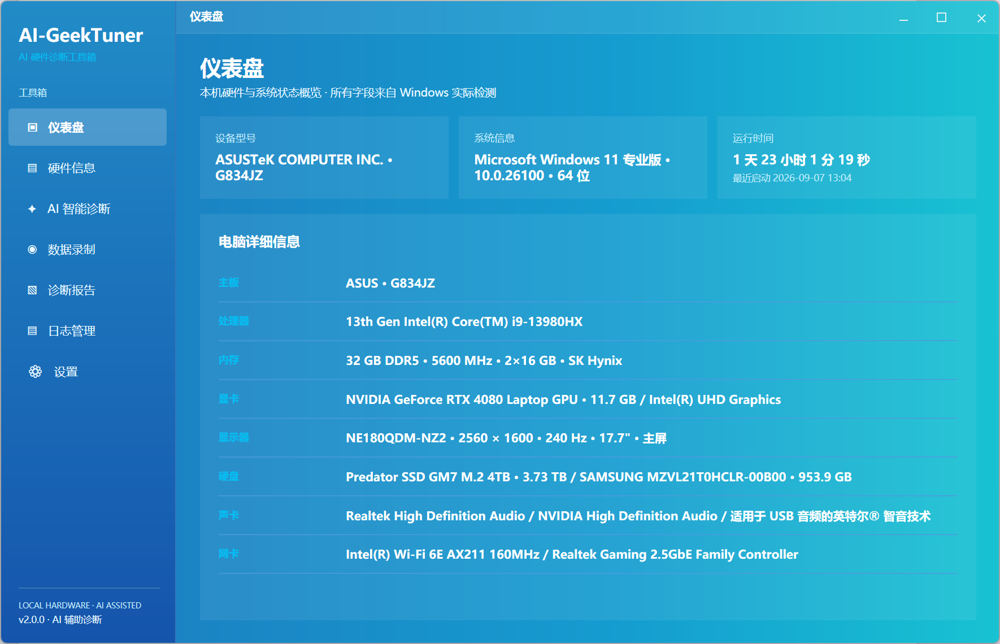
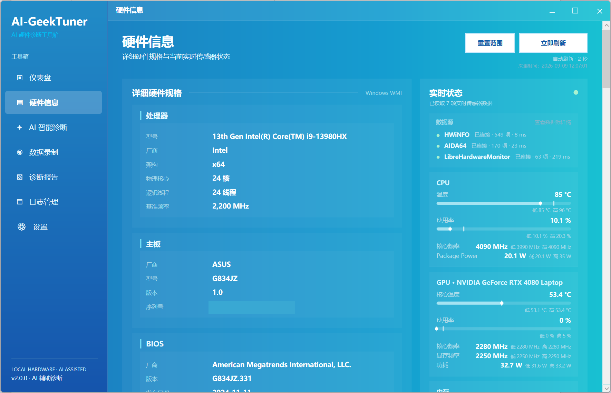
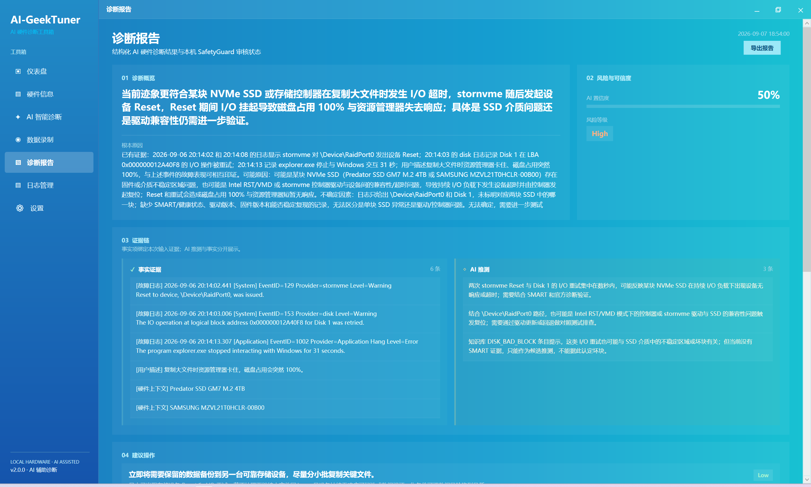
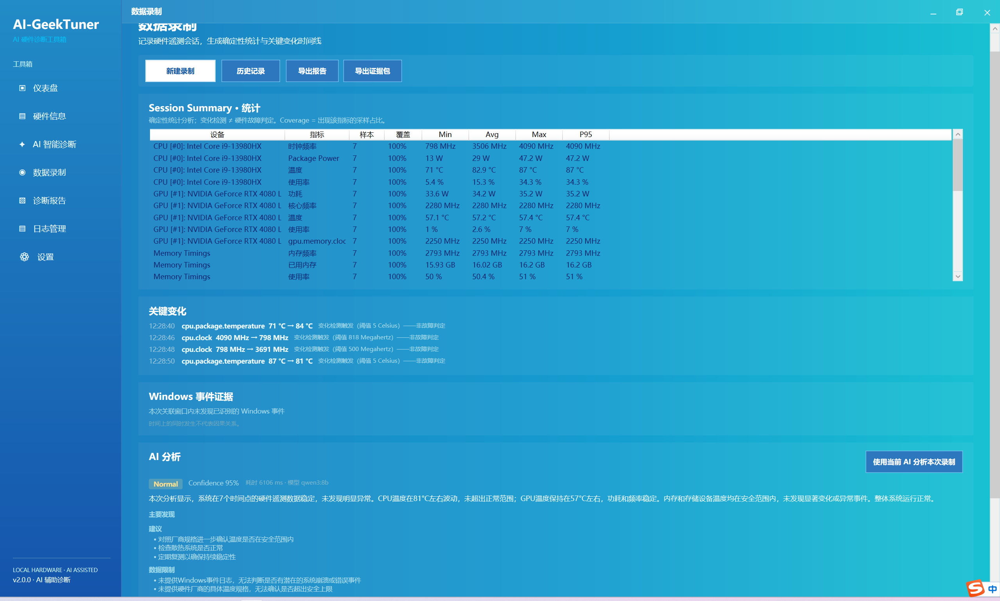
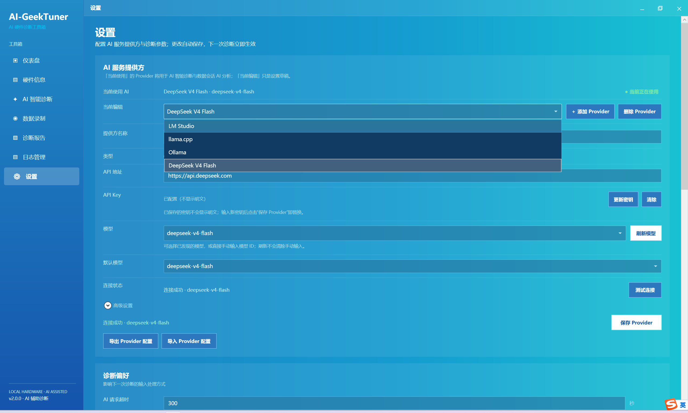
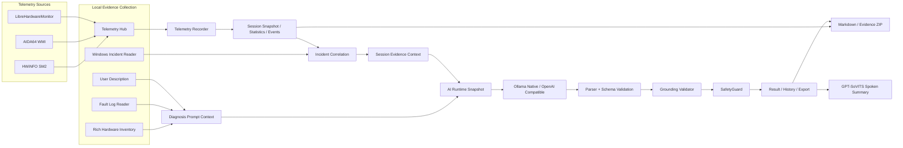

<div align="center">


# AIGeekTuner

**面向 Windows 的 AI 硬件监控、故障取证与证据约束诊断工具**

把静态硬件清单、实时遥测、Windows 事件、故障日志与 AI 推理串成一条可追溯的诊断链：<br>
**真实采集 → 证据归一 → 事件关联 → AI 分析 → Grounding 校验 → SafetyGuard → 报告 / 证据包**

[](https://github.com/nanfeilaotou/AIGeekTuner/releases)
[](https://dotnet.microsoft.com/)
[](https://learn.microsoft.com/dotnet/desktop/wpf/)
[](https://www.microsoft.com/windows/)
[](#tests--quality-gates)
[](#tests--quality-gates)
[](https://github.com/nanfeilaotou/AIGeekTuner/stargazers)
[](https://github.com/nanfeilaotou/AIGeekTuner/releases)
[](https://github.com/nanfeilaotou/AIGeekTuner/commits/main)

**Tech Stack**

`C#` · `.NET 8` · `WPF` · `WMI` · `DXGI` · `CoreAudio` · `HWiNFO Shared Memory` · `AIDA64 WMI` · `LibreHardwareMonitor` · `OpenAI-Compatible API` · `Ollama` · `GPT-SoVITS`

</div>

---

AIGeekTuner v2.0 不再只是“把一份日志交给大模型总结”。它同时维护 **硬件静态事实、实时传感器数据、Windows 事件证据、录制会话统计、用户故障描述与原始日志**，并在 AI 输出后继续执行确定性的证据校验和安全复核。

项目的目标不是替代专业维修工具，而是把 Windows 电脑故障排查中分散的 **采集、记录、关联、分析和导出** 整理成一条可以复现、可以审计、可以继续验证的工作流。

当前首发范围为 **Windows 10/11 x64（win-x64）**。正式发布包采用 **self-contained .NET 8 WPF**，目标机无需预装 .NET Desktop Runtime；请完整解压发布 ZIP 后运行。详见 [Release 说明](docs/RELEASE.md)。

## Highlights

- **Rich Hardware Inventory**：采集 CPU、主板、BIOS、内存条、GPU、显示器、磁盘/卷、声卡、网卡、操作系统等静态信息，并统一呈现可获取的 VRAM、EDID/GDI、容量与设备属性。
- **Multi-source Telemetry Hub**：统一 HWiNFO、AIDA64、LibreHardwareMonitor 三类来源，同一指标按固定优先级选择单一来源并保留 provenance，不对多源数据做平均。
- **Conservative Device Identity**：保留 Provider 原生设备标识；证据不足时宁可维持独立设备，也不把两块物理设备低置信度合并。
- **Live Hardware View**：CPU / GPU / 内存 / 磁盘等关键指标实时刷新，展示温度、利用率、频率、功耗、来源状态与会话内 Low / High。
- **Diagnostic Recorder**：手动录制统一遥测快照，停止后生成 Min / Avg / Max / P50 / P95 / P99、覆盖率、关键变化、采样缺口与来源切换记录。
- **Windows Incident Evidence**：采集 Kernel-Power、WHEA、Display/TDR、磁盘、应用崩溃/卡死、WER 等 Windows 事件，并与遥测 Session 做时间关联；时间相关性不会被直接当作因果。
- **Evidence-grounded AI Diagnosis**：模型生成的 `Fact` 必须绑定本次请求中的 `sourceId` 与逐字符 `sourceQuote`；不存在的引用、上一轮引用或模型改写出的“事实”不能通过 Grounding。
- **Provider-neutral AI Runtime**：支持 Ollama Native 与 OpenAI-Compatible Runtime，可配置 LM Studio、llama.cpp、DeepSeek 等服务；请求开始时捕获不可变 runtime snapshot。
- **Structured Output + One Repair**：强类型 JSON 结果、枚举/范围校验与 Grounding 校验；结构或 Grounding 第一次失败时最多自动修复一次，仍失败则 fail closed。
- **Local SafetyGuard**：日志诊断与 Session AI 都在结果展示、保存与 TTS 前执行本地安全复核，拦截危险电压、关闭保护机制、绕过安全限制及低置信度绝对化建议。
- **Session AI + Persistent Voice Cache**：录制会话可生成结构化 AI 分析与 Spoken Summary；GPT-SoVITS 语音按 Session 持久缓存，重新打开应用或 Session 时可以直接复用。
- **Portable Exports**：Session 可导出 Markdown 报告与 Evidence ZIP；Application Settings v2 与 AI Provider v1 可独立导入/导出，API Key / DPAPI credential 不进入备份文件。
- **Windows-native Shell**：自定义 WindowChrome、DWM 圆角、任务栏工作区最大化、原生最小化/还原动画、窗口拖动与正常 client-area 滚轮输入。
- **Encoding & Long-log Safety**：支持 UTF-8 / UTF-16 / GB18030；超长日志进行有界裁剪并显式标记，模型不能引用未实际进入 Prompt 的内容。

## Screenshots

<p align="center">
  <a href="docs/screenshots/dashboard.png">
    
  </a>
  <br>
  <sub>Dashboard · 仪表盘与系统概览</sub>
</p>

<p align="center">
  <a href="docs/screenshots/hardware.png">
    
  </a>
  <a href="docs/screenshots/diagnosis.png">
    
  </a>
  <br>
  <sub>Hardware · 硬件详情与实时遥测　　Diagnosis · 日志诊断结果</sub>
</p>

<p align="center">
  <a href="docs/screenshots/recorder.png">
    
  </a>
  <a href="docs/screenshots/settings.png">
    
  </a>
  <br>
  <sub>Recorder · 遥测录制与 Session　　Settings · 数据源与 AI Provider</sub>
</p>

## Feature Matrix

| 模块 | v2.0 能力 |
| --- | --- |
| Dashboard | 型号、Windows、运行时间与 CPU / GPU / 内存 / 主板 / 显示器 / 磁盘 / 声卡 / 网卡摘要 |
| Hardware Inventory | CPU、Board、BIOS、DIMM、GPU、Monitor、Disk/Volume、Audio、Network、OS 等 Rich Inventory |
| Hardware Live | 温度、利用率、频率、功耗、多磁盘温度、可用 DIMM 温度、来源状态、Low / High 跟踪 |
| Telemetry Hub | HWiNFO / AIDA64 / LibreHardwareMonitor canonical metrics、来源选择、provenance、保守设备 reconciliation |
| Recorder | 1 / 2 / 5 秒采样，Session 本地持久化、统计、关键变化、来源切换、采样缺口 |
| Windows Incident | Kernel-Power、WHEA、Display/TDR、Disk、Application Crash/Hang、WER |
| AI Diagnosis | 用户描述 + 故障日志 + 硬件/系统上下文，结构化 Fact / Inference / Recommendation |
| Evidence Grounding | `sourceId` 白名单、`sourceQuote` Ordinal 子串校验、request identity、fail closed |
| AI Provider | Ollama Native + OpenAI-Compatible；LM Studio / llama.cpp / DeepSeek 等均可配置 |
| Session AI | Telemetry + Incident 统一证据上下文、evidence ID 校验、SafetyGuard、Structured Analysis |
| Voice | GPT-SoVITS API v2、Spoken Summary、WAV 持久缓存与重启恢复 |
| History / Reports | Diagnosis History、Session History、Markdown 报告、Evidence ZIP |
| Settings | Application Settings 自动保存；Provider 独立 Draft → Test → Save → Activate |
| Portability | Settings v2 / Provider v1 独立导入导出；API Key / DPAPI credential 永不导出 |
| Window Shell | Integrated WindowChrome、DWM 圆角、rcWork 最大化、原生任务栏语义、App Icon |

## Architecture



### 1. Rich Hardware Inventory

静态硬件清单与实时遥测分离。Dashboard / Hardware 页面使用 Windows 本机接口构建 Rich Inventory，不要求 HWiNFO 或 AIDA64 才能显示基础硬件信息。

采集覆盖：

- CPU 型号与基础规格
- 主板与 BIOS
- 物理内存模块：厂商、容量、频率、插槽、Part Number 等
- NVIDIA / AMD / Intel GPU，以及可获取的独立显存信息
- 显示器：EDID / GDI 信息、分辨率、刷新率、主屏标记
- 物理磁盘与卷
- CoreAudio / 声音控制器
- 有线 / 无线网络适配器
- Windows / 启动时间 / Uptime

启动阶段使用 single-flight Rich Inventory；不同采集类别可并行执行，单个类别失败不会阻塞整个硬件清单。

### 2. Multi-source Telemetry Hub

AIGeekTuner 将多个监控来源归一为统一 canonical telemetry domain。每个值不仅有数值，还保留设备身份、指标类型、单位、来源与时间。

| 来源 | 接入方式 | 定位 |
| --- | --- | --- |
| **HWiNFO** | Shared Memory / SM2 | 可选高优先级来源；需用户自行安装并启用 Shared Memory Support |
| **AIDA64** | `Root\WMI\AIDA64_SensorValues` | 可选来源；需在 External Applications 中启用 WMI 数据导出 |
| **LibreHardwareMonitor** | 内置库 | 默认来源；某些低层传感器仍取决于 PawnIO、驱动、权限和具体硬件 |

同一指标按 **HWiNFO → AIDA64 → LibreHardwareMonitor** 选择单一来源，不进行来源间平均。跨 Provider 设备合并要求有足够身份依据；证据不足时保留来源本地身份，避免把不同物理设备错误融合。

Provider 读取具有独立等待边界与单 in-flight 约束。某个底层 WMI / native 调用超时后，本轮可以降级返回，但在真实底层任务仍未结束时不会持续启动新的同 Provider 读取。Live Telemetry 通过 generation 校验阻止旧任务覆盖新状态。

当前为规避 LibreHardwareMonitor 0.9.6 的 Intel GPU 组合枚举风险，CPU 与 GPU 使用分离实例；Intel 集显实时指标可能不完整或缺失，不承诺所有 Intel GPU / LHM 传感器可用。

### 3. Live Hardware Presentation

Hardware 页面在 Rich Inventory 基础上叠加实时指标：

- CPU：温度、利用率、频率、功耗
- GPU：可用的核心/热点/显存温度、利用率、核心/显存频率、功耗
- Memory：使用率、已用容量、运行频率、可用的 DIMM 温度
- Disk：按物理设备显示温度
- Provider 状态：HWiNFO / AIDA64 / LHM Ready / Unavailable / Needs Configuration / Timeout / Busy 等状态

温度与利用率使用 meter 展示；当前会话的 Low / High 由 AIGeekTuner 自己跟踪。录制页面读取不可变增量快照，不会为了刷新 UI 反复遍历后台持续增长的完整 Samples 列表。

## Diagnostic Recording & Incident Evidence

### Telemetry Recorder

Recorder 以统一 snapshot 为输入，不直接绑定某个厂商 Provider。用户开始录制后按固定周期采样，停止时生成确定性统计并落盘。

- 采样间隔：1 / 2（默认）/ 5 秒
- 统计：Min / Avg / Max / P50 / P95 / P99 / coverage
- 关键变化：温度跳变、利用率大幅变化、频率/功耗显著变化、CPU throttling、Provider 来源切换、采样缺口
- 多设备实例与来源 provenance 全程保留
- Session 正常 Stop / Finalize 后原子持久化，不依赖 AI 才能成立
- 完整历史用于最终保存和分析；实时 UI 使用增量不可变快照

当前 Recorder **不是 crash-safe / BSOD black-box recorder**：异常断电、蓝屏、进程崩溃或强制结束，可能丢失当前尚未 Finalize 的 Session。

### Windows Incident Evidence

Windows 事件是另一条确定性证据来源。v2.0 会读取并归类：

- Kernel-Power / Unexpected Shutdown
- WHEA hardware error
- Display / TDR
- Disk / storage error
- Application Crash / Hang
- Windows Error Reporting

查询会尽可能在 Event Log 层筛选目标 Provider / Event ID、优先最近事件，并在结果可能被数量上限截断时显式标记。

Incident 可与完成的遥测 Session 按时间窗口关联，但系统遵循 **correlation ≠ causation**：时间接近只能作为线索，不能自动证明“某个温度峰值导致了某个崩溃”。

## AI Diagnosis & Evidence Grounding

### Fact / Inference 分层

AIGeekTuner 不允许模型把“听起来像真的”直接当作事实。诊断输出将内容区分为：

- **Fact**：必须能绑定本次请求中的真实 source
- **Inference**：AI 基于事实给出的可能解释
- **Unknown / Low-confidence**：证据不足时明确保留不确定性
- **Recommendation**：下一步验证或安全处置建议

### Source-grounded Facts

每个新 Fact 都必须包含类似：

```json
{
  "sourceId": "source:fault-log",
  "sourceQuote": "Display driver nvlddmkm stopped responding and has successfully recovered."
}
```

Grounding Validator 会确定性检查：

1. `sourceId` 必须属于**本次请求**；
2. `sourceQuote` 不得为空；
3. `sourceQuote.Trim()` 必须是对应 source 内容中的 **Ordinal Unicode 子串**；
4. 不能引用上一轮请求、Knowledge Base 或模型自造 source；
5. UI 中“事实证据”优先显示校验后的原始 `sourceQuote`，不是模型自行改写的描述。

这意味着“用户只说电脑卡顿，模型却把并不存在的电池故障描述成用户原话”之类的内容不会作为 Fact 通过。

### Structured Output & One Repair

AI 响应经过：

```text
Provider Response
    ↓
JSON Parser / Schema
    ↓
Grounding Validator
    ↓
SafetyGuard
    ↓
Result / Persistence / TTS
```

如果 JSON 结构或 Grounding 第一次失败，会使用**同一份 runtime snapshot**最多进行一次 repair。repair 仍然失败时，诊断 fail closed，不展示未经证据约束的 Fact。

HTTP、认证、超时、取消等传输失败不会被错误地当成“模型格式问题”进行 repair。

### SafetyGuard

SafetyGuard 位于本机，和 AI Provider 无关。日志诊断与 Session AI 统一经过本地安全复核，例如：

- 异常高电压建议
- 禁用硬件保护机制
- 绕过安全限制
- 低置信度却使用绝对化诊断措辞
- 其它高风险操作建议

Grounding 解决“事实从哪里来”，SafetyGuard 解决“这个建议是否安全”。对于 Session AI，最终持久化、UI 展示与 TTS 使用的是 SafetyGuard 后的同一版本。

## Unified AI Provider Runtime

v2.0 将旧的 Ollama-only 路径升级为统一 Provider Runtime。

支持：

- **Ollama Native**
- **LM Studio**
- **llama.cpp**
- **DeepSeek**
- 其它符合 `/chat/completions` 语义的 **OpenAI-Compatible** 服务

Provider Profile 保存 Display Name、Kind、Base URL、Models、Default Model、Structured Output Mode、Enabled 等非敏感配置。API Key 独立存放在 Windows DPAPI credential store 中，不进入 Provider JSON。

### Credential Boundary

凭据不仅按 Provider ID 管理，还与目标 origin 的安全边界结合处理。已有 Provider 的 scheme / host / port 发生变化时，不会静默把旧 API Key 自动发送到新的 origin；仅 path 变化则不会无意义破坏同一服务的正常配置。

Provider 配置导入不会把 API Key 写入 portable file，也不会因为“导入文件不含秘密”而自动授予新目标使用旧凭据的权限。

### Runtime Snapshot

每次 AI 请求开始时捕获不可变 `AiRuntimeSnapshot`：

```text
Provider
Model
Base URL
Structured Output Mode
Credential
Timeout
```

之后即使用户在 Settings 中切换 Provider，也只影响**下一次请求**；正在运行的 Diagnosis / Session Analysis 继续使用启动时的 snapshot，repair 也使用同一份 snapshot。

### Structured Output Modes

不同服务对 JSON/schema 的支持不同，因此 Provider 可配置相应模式：

- Native Schema
- OpenAI JSON Schema
- JSON Object
- Prompt Only

Ollama Native 与 OpenAI-Compatible transport 会根据协议能力映射，而不是在业务层硬编码某一家服务。

## Session AI & Voice

Session Analysis 将遥测统计、关键变化与 Windows Incident 组成证据上下文，AI 只能引用允许的 evidence ID，例如：

```text
stat:...
event:...
incident:...
```

Session AI 与页面生命周期解耦采用明确的 ownership / cancellation 规则：已删除、已被新分析取代或已经失效的旧任务不能在晚到后覆盖当前结果。

语音缓存则采用不同语义：**已经成功生成并与当前分析匹配的语音是 Session 的持久数据，而不是页面级临时缓存。** 页面切换、ViewModel 重建或应用重启后，只要缓存仍对应当前分析，就可以直接复用，无需再次生成。删除 Session 时才会清理对应语音。

GPT-SoVITS 通过 API v2 接入；语音层属于 presentation 能力，不参与 Fact Grounding，也不是 Evidence ZIP 的必要诊断证据。

### GPT-SoVITS Configuration

GPT-SoVITS 是完全可选功能。可以在 `Settings` 中配置：

- Endpoint
- Reference Audio Path
- Reference Audio Transcript
- Reference Audio Language（`zh` / `ja` / `en`）
- Speed Factor

`Reference Audio Path` 必须是 GPT-SoVITS 服务进程能够访问的路径。本机运行服务时可以填写本机路径；如果服务运行在另一台电脑上，该路径必须对远端 GPT-SoVITS 服务可见，AIGeekTuner 不会自动上传本机文件。

`PromptLang` 表示参考音频语言；当前 Spoken Summary 正文固定使用 `text_lang = zh` 合成，不表示正文支持多语言 TTS。

fresh install 默认不会主动切换 GPT / SoVITS 权重，而是使用 GPT-SoVITS 服务当前已经加载的模型。成功生成的 `voice.wav` 按 Session / analysis identity 持久缓存，页面切换和程序重启后可以复用；删除 Session 时对应缓存会被清理。

GPT-SoVITS 配置失败或服务离线，不影响 Session 文本分析、Session 数据保存或 Evidence。

## Export, Backup & Portability

### Session Export

Session Detail 支持两种输出：

**Markdown Report**

包含基本信息、硬件摘要、遥测统计、关键变化、Windows Incident、AI Analysis 与数据说明。

**Evidence ZIP**

包含已经持久化的确定性数据，例如：

```text
README.md
report.md
session.json
incidents.json    # 有则包含
analysis.json     # 有则包含
```

导出时不会重新采样、重新读取 Event Log 或重新调用 AI，因此导出结果与原 Session 保持一致。`voice.wav` 默认不放入证据包。

### Application Settings v2

Application Settings 使用独立的 versioned portable schema，可导出 / 导入：

- Diagnosis history behavior
- AI timeout
- Fault log input limit
- Recording interval
- Hardware refresh
- GPT-SoVITS / Voice 非敏感配置
- 其它当前应用偏好

普通 Settings 使用 auto-save：Toggle / Combo 等合法变更立即持久化；Text / Numeric 输入经过校验与短 debounce 后保存。Provider 配置不采用 auto-save。

### Provider Configuration v1

AI Provider 单独导出，不与 Application Settings 混为一个文件。导入采用非破坏 merge / update：

- 相同 Provider ID 更新非敏感字段
- 本机已有 credential 按安全 origin 规则处理
- 新 Provider 可导入，但 credential 为空
- 本机独有 Provider 不会因为导入文件缺失而被删除
- 有效 imported activeProviderId 可恢复 active Provider

导出文件始终：

```json
{
  "credentialsIncluded": false
}
```

**API Key 明文、DPAPI blob、`credentials.json` 永不导出。**

## Settings Model

Application Settings 与 AI Provider 采用不同产品语义：

| 区域 | 保存策略 |
| --- | --- |
| 常规开关 / 下拉 | 合法变更立即保存 |
| Text / Numeric | 校验通过后 debounce 保存，Enter / LostFocus 可立即提交 |
| AI Provider | Draft → Test Connection → Save Provider → Set Active |
| API Key | 独立 credential store，不出现在 portable export |

Provider 的 destructive / sensitive 状态不会仅依靠 `null` 表达；保存失败时凭据回滚能够区分 Keep / Replace / Remove，避免配置失败误删已有 Key。

## Windows Shell

v2.0 对默认 WPF 窗口壳进行了产品化处理：

- 一体化 WindowChrome，自定义 Minimize / Maximize / Close
- Windows 11 DWM rounded corners
- Normal 尺寸采用应用既定窗口规格
- 最大化使用当前显示器工作区，不覆盖任务栏
- Taskbar 点击最小化 / 还原遵循标准 Windows Shell 语义
- 原生 minimize / restore 动画保留
- 页面普通 client content 保留正常滚轮输入
- 普通 TextBlock / Card / Grid / Sidebar 空白可直接拖动窗口
- Button / TextBox / ComboBox / DataGrid / ScrollBar 等交互元素不会误触发窗口拖动
- 多显示器与 Windows DPI scaling 保持系统语义

## Reliability

v2.0 专门处理了一批桌面硬件工具容易出现的边界问题：

- Hardware Inventory 使用 single-flight，避免多个页面重复采集；不同类别可以并行，单个类别失败不拖垮整个应用。
- Telemetry Provider 使用等待 deadline 与单 in-flight 约束；超时不等于强行杀死底层 native/WMI 调用，但不会因为轮询继续堆积同源任务。
- Live Telemetry 使用 generation / ownership 校验，旧异步读取不能覆盖新状态或跨模式发布。
- Device Identity 保留来源原生标识并采用保守 reconciliation；证据不足时不猜测合并。
- Recorder 向 UI 发布不可变增量快照，避免后台写入与前台枚举共享可变 Samples。
- CoreAudio 原生互操作使用与 Windows ABI 匹配的 PROPVARIANT 布局，并按 HRESULT 语义处理成功/失败与资源清理。
- Diagnosis Request 带独立 RequestId；旧请求完成后不能抢占新页面或覆盖当前 Result。
- Session AI 使用 Session ownership 隔离；切换历史记录不会把其它 Session 的 AI / Voice 状态显示过来。
- Session ID / managed path 统一执行边界校验；删除、分析、事件、语音等受管理文件操作采用 fail-closed 规则。
- 配置导入先完整解析和验证，再应用；失败不会形成“半导入”。
- Session / History / Settings 使用原子写入与相应恢复策略处理损坏或中断。
- Startup Breadcrumb 与 Exception Log 用于定位启动 / native 问题，但不记录 Prompt、API Key 或用户私密诊断内容。

## Log Input & Long-context Behavior

支持：

- UTF-8
- UTF-16
- GB18030

大日志进入 AI 前有明确字符上限。v2.0 对超长内容使用 bounded head/tail 策略并插入截断标记，因此：

- 模型知道原始日志被裁剪；
- Grounding 只允许引用实际进入 Prompt 的片段；
- 不会因为原文件包含某行，就允许 AI 引用已经被裁掉的中间内容。

未来可以加入本地 Error / Warning / EventID 预筛选，以提高超长日志中段异常的召回率；这不是 v2.0 的发布阻塞项。

## Privacy & Security

AIGeekTuner 把“本地采集”和“AI 推理”明确区分。

**始终在本机完成：**

- Hardware Inventory
- Telemetry aggregation
- Windows Incident acquisition
- Log decoding / truncation
- Grounding validation
- SafetyGuard
- History / Session persistence
- Settings / credential storage
- Report / Evidence ZIP export

**取决于当前 Provider：**

- AI inference
- repair request
- Session AI analysis

AI 推理请求只发送到当前保存并激活的 Provider `BaseUrl`。使用 `localhost` Provider 时，AI 上下文可以保持本机处理；使用局域网或互联网 Provider 时，故障日志、用户描述、硬件 / Session 摘要及相关证据会发送到对应服务，并按该服务自身的日志、保留与隐私政策处理。

因此 AIGeekTuner 不笼统承诺“完全本地”或“绝对隐私”；是否有诊断数据离开本机由当前 Provider 决定。

API credential 使用 Windows DPAPI 存储，Provider export 不读取 credential store。

## Quick Start

### Requirements

- Windows 10 / 11 x64（win-x64；不承诺 x86 / ARM64）
- 至少配置一个可用 AI Provider
- HWiNFO / AIDA64 均为可选，不影响基础硬件清单
- 官方首发包为 self-contained，无需另外安装 .NET Desktop Runtime

### Download Release

从 [Releases](https://github.com/nanfeilaotou/AIGeekTuner/releases) 下载：

```text
AIGeekTuner-2.0.0-win-x64.zip
```

完整解压后运行 `AIGeekTuner.exe`。不要只复制单个 exe，也不要把源码构建目录中的文件当作正式发布包。

发布方式、可选依赖与干净机验收见 [docs/RELEASE.md](docs/RELEASE.md)。

### Clone & Run

```bash
git clone https://github.com/nanfeilaotou/AIGeekTuner.git
cd AIGeekTuner
dotnet restore
dotnet run --project AIGeekTuner/AIGeekTuner.csproj
```

### Local Ollama Example

```bash
ollama pull qwen3:8b
ollama serve
```

然后在 Settings → AI Provider 中选择 / 创建 Ollama Profile，保存并设为当前使用即可。

### Other Providers

LM Studio / llama.cpp 等本地服务可使用 OpenAI-Compatible Profile；云端兼容服务填写对应 Base URL、Model 与 API Key。Provider 页面支持独立测试连接、保存和激活。

## Data Sources

| 数据 | 默认 / 内置 | 可选外部来源 |
| --- | --- | --- |
| Static Hardware Inventory | Windows WMI / DXGI / GDI / CoreAudio / Network APIs | 无需外部工具 |
| Realtime Telemetry | LibreHardwareMonitor | HWiNFO / AIDA64 |
| Windows Incidents | Windows Event Log | 无 |
| Fault Logs | 用户导入 `.txt` / `.log` | 无 |
| AI | 用户选择 | Ollama / LM Studio / llama.cpp / DeepSeek / OpenAI-Compatible |
| Voice | 可选 | GPT-SoVITS API v2 |

> AIGeekTuner 不捆绑 HWiNFO 或 AIDA64，不自动下载，也不会自动修改这些工具的设置。LibreHardwareMonitor 为内置库，但其部分低层传感器能力仍可能依赖 PawnIO、驱动、权限与具体硬件环境。

## Persistence

主要数据职责：

```text
Settings
├─ application settings
├─ provider catalog
└─ DPAPI credentials

History
└─ diagnosis records

Sessions/{id}
├─ session.json
├─ incidents.json
├─ analysis.json
├─ voice.wav
└─ voice.wav.meta.json
```

Session 数据位于应用的本地数据目录中。正常 Stop / Finalize 后的 Session 会持久保存；异常终止期间尚未 Finalize 的当前 Session 不保证恢复。

## Tests & Quality Gates

```bash
dotnet test
dotnet test -c Release
```

当前 v2.0.0 发布质量门：

- **913 / 913 tests passed**
- **Debug: 0 warnings / 0 errors**
- **Release: 0 warnings / 0 errors**
- **Release x64 full test gate: PASS**
- **self-contained win-x64 publish: PASS**
- `git diff --check`: PASS

自动化覆盖包括 Parser、Prompt/source 构建、Grounding、SafetyGuard、Provider Runtime、runtime snapshot isolation、Credential rollback / cross-origin protection、FileReader 编码、History、Session Analysis、Voice cache、Telemetry Hub、Provider timeout / lifecycle、Device Identity、AIDA64/HWiNFO mapping、Recorder、Windows Incident、Session path guard、Settings portability、WindowChrome 与页面构造等。

测试可以约束代码契约，但不能替代所有真实硬件矩阵。真实双 GPU、不同传感器实现、权限受限 Event Log、无音频设备和外部组件缺失等环境仍需持续实机验证。

## Project Structure

```text
AIGeekTuner/
├─ Commands/
├─ Configuration/
├─ Controls/
├─ Converters/
├─ KnowledgeBase/
├─ Models/
│  ├─ Hardware/
│  ├─ Incidents/
│  ├─ Sessions/
│  └─ Telemetry/
├─ Services/
│  ├─ AI/Providers/
│  ├─ Diagnosis/
│  ├─ Diagnostics/
│  ├─ Hardware/Inventory/
│  ├─ History/
│  ├─ Incidents/
│  ├─ Reports/
│  ├─ Safety/
│  ├─ SessionAnalysis/
│  ├─ Settings/
│  ├─ Telemetry/
│  └─ Voice/
├─ Themes/
├─ ViewModels/
└─ Views/
```

## Design Principles

1. **No fabricated hardware facts** — 采不到就明确缺失，不用模型补值。
2. **Evidence before inference** — 先保存真实 source，再允许 AI 推断。
3. **Correlation is not causation** — 遥测峰值和 Windows 事件时间接近不等于因果成立。
4. **Provider-neutral** — 业务逻辑不绑定 Ollama、DeepSeek 或某一家服务。
5. **Immutable in-flight runtime** — 设置修改不影响已经开始的请求。
6. **Local safety boundary** — Grounding / SafetyGuard / Persistence 不交给云端模型决定。
7. **Fail closed** — AI 输出结构、证据或受管理路径不合格时宁可失败，也不继续危险操作。
8. **Conservative identity** — 无足够证据时不把两个物理设备猜成同一设备。
9. **Best-effort hardware acquisition** — 单个硬件类别或数据源失败不能拖垮整个应用。
10. **Portable without secrets** — 配置可以迁移，凭据不跟着导出。
11. **Windows-native UX where it matters** — Taskbar、DPI、工作区最大化、滚轮和窗口状态遵循 Windows 语义。

## Limitations

- 当前公开发布范围为 **Windows 10/11 x64**；不承诺 x86、ARM64、Linux 或 macOS。
- AI 诊断是辅助分析，不替代专业硬件维修、厂商检测工具或现场测量。
- WMI / 驱动 / BIOS / 传感器实现差异会导致部分设备字段不可读；AIGeekTuner 会显示缺失而不是伪造。
- Intel 集成显卡的 LibreHardwareMonitor 实时指标可能不完整或缺失。
- HWiNFO、AIDA64、PawnIO、AI Provider、GPT-SoVITS 与音频输出均为可选能力；缺失时对应功能降级。
- Recorder 当前只保证正常 Stop / Finalize 后的 Session 持久化，不是 crash-safe / BSOD black-box recorder。
- 发布包当前未配置代码签名；目标机器是否允许运行取决于 Windows / 组织安全策略，不应关闭 Defender、SmartScreen、内存完整性或驱动签名来绕过。
- 超长日志当前采用 bounded head/tail，而不是完整语义检索；中间异常可能因此未进入 AI 上下文。
- 不解析 Minidump 二进制文件。
- 不执行 BIOS、超频、电压修改或关闭硬件保护机制等写操作。
- 不保证所有 OpenAI-Compatible 服务都实现完全相同的 structured output 扩展；必要时可使用兼容模式。
- AI 仍可能做出错误推断；请结合 confidence、Fact / Inference 分区与原始证据自行判断。

## Roadmap

v2.0 核心范围已经完成。后续可以继续探索：

- crash-recovery / recorder checkpoint
- 超长日志本地 Error / Warning / EventID 预筛选
- 更完整的 Frame Timing / 游戏性能诊断
- Controlled Reproduction / Scenario Runner
- 更多真实硬件矩阵验证
- installer / code signing / auto-update
- 更多主题与 UI 个性化

这些方向不会改变 v2.0 的核心原则：**采集结果可追溯，AI 事实可验证，配置可迁移，危险建议由本地规则复核。**

## Contributing

Issue / PR 均欢迎。提交前建议至少运行：

```bash
dotnet test
dotnet test -c Release
```

修改 Hardware / Telemetry / WindowChrome / AI Runtime 时，请避免破坏现有 provider independence、source grounding、credential boundary 与 Windows shell invariants。

## Disclaimer

AIGeekTuner 提供的是辅助诊断信息。硬件维修、BIOS 更新、固件刷新、电压/频率调整等操作具有风险，请根据设备厂商文档和专业检测结果自行判断。

---

<div align="center">

**AIGeekTuner v2.0**<br>
Local Hardware · Evidence Grounding · AI Assisted

[Repository](https://github.com/nanfeilaotou/AIGeekTuner) ·
[Issues](https://github.com/nanfeilaotou/AIGeekTuner/issues) ·
[Releases](https://github.com/nanfeilaotou/AIGeekTuner/releases)

</div>
